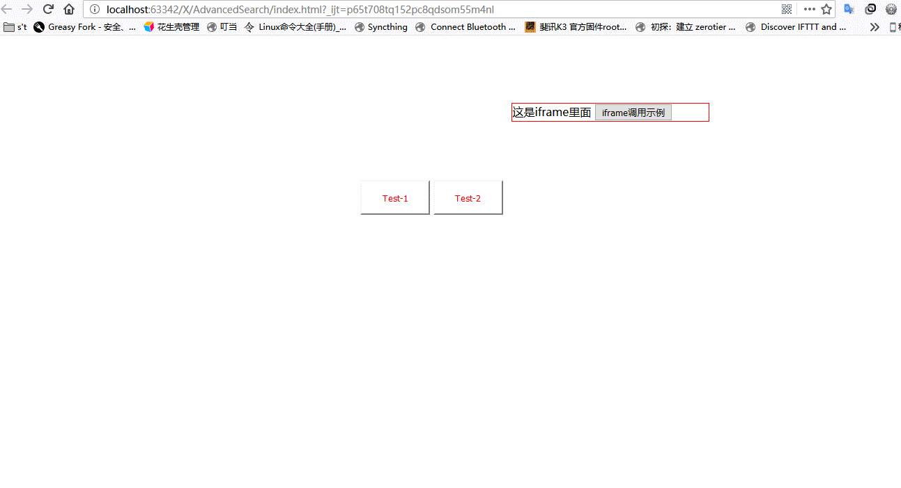

# AdvancedSearch
# 文档
<a href="https://github.com/xizirumeng/AdvancedSearch/wiki">文档</a>


# 使用

## 第一步
* 引入AdvancedSearch样式文件（推荐在放在其它框架后面）
```
<link rel="stylesheet" href="/AdvancedSearch.css">
```
需要注意的是，AdvancedSearch会将所在环境<html>标签中的字体大小更改为
```
font-size: medium;//默认字体大小
```
<font color="red">这可能导致你的整体布局错乱</font>

* 引入AdvancedSearch脚本文件
```
<script src="/AdvancedSearch.js"></script>
```
正常情况下，AdvancedSearch所产生的页面元素不会对其它布局产生影响，所有选择器都包含advancedsearch字符串

## 第二步
* 初始化
** AdvancedSearch目前支持三种类型，它们分别是select、txt、date
``` javascript
var as = new AsSearch("#btn", {//绑定id为btn的元素，当该元素发生点击事件时，会显示AdvancedSearch页面
        columns: [
            {
                title: "性别",
                code: "sex",
                type: "select",
                explanation: {"男": "1", "女": "0"},
            }
            , {
                title: "姓名",
                code: "name",
                type: "txt"
            }
            , {
                title: "时间",
                code: "date",
                type: "date",
                dateFormat:""
            }],
        search: function(result){
            alert("结果：\n"+JSON.stringify(result));
            console.log("结果："+ JSON.stringify(result));
        },
        dateInput: function (obj,dateFormat) {
        //date类型的input需要单独初始化，这取决于你的框架
        //obj为input对象数组，dateFormat为格式化参数

        //bootstrap table例：
//            $(obj).attr({"data-date-format": dateFormat});
//            $(obj).datetimepicker({
//                //language:  'fr',
//                weekStart: 1,
//                todayBtn: 1,
//                autoclose: 1,
//                todayHighlight: 1,
//                startView: 2,
//                forceParse: 0,
//                showMeridian: 1
//            });
        }
    });
```
* 或者你也可以直接这样使用
``` javascript
AsSearch("#btn", {...});
```
